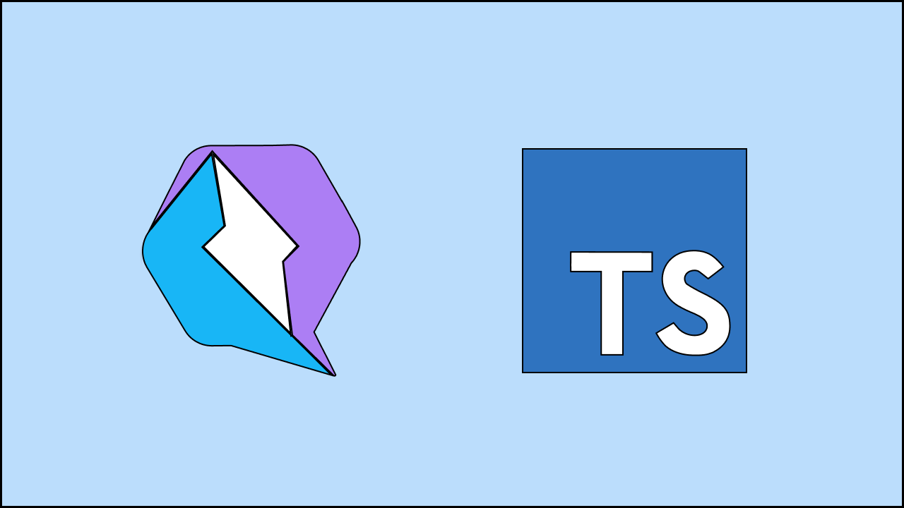

# Curso de Qwik para principiantes en español

Aquí encontrarás toda la información del curso de Qwik para principiantes en español (LINK).

## Cómo acceder al curso

El curso se encuentra en UDEMY y puedes acceder a él a través del siguiente enlace: https://www.enlaceaudemy.com.

Este es el repositorio principal del curso, pero he decidido crear distintos repositorios dependiendo de las secciones que vayamos viendo. Puedes acceder a cada uno de los diferentes repositorios de las secciones desde esta navegación:

- [00 - Conceptos Básicos](https://www.enlaceaudemy.com)
- [01 - Aplicación del Tiempo](https://www.enlaceaudemy.com)
- [02 - Aplicación de Pokédex](https://www.enlaceaudemy.com)

El curso lo estoy haciendo con la versión de Node 16.15.1, así que de esa versión en adelante todo debería ir bien.

## Instrucciones para tomar el curso

En cada uno de los proyectos verás un README con explicaciones de su funcionamiento, pero por lo general una vez terminados los conceptos básicos, tendremos una branch `start` con todo el contenido inicial, una branch `main` o `master` con el resultado final, y branches entre medio.

El proceso sería más o menos el siguiente.

Clonar el repo:

    git clone https://www.enlaceaudemy.com
    cd nameoftheproject

Cambiamos a la branch start.

    git checkout start

Instalamos las dependencias:

    npm install

## Otros cursos y contacto

Échale un vistazo a mis otros cursos de Udemy sobre programación y diseño web. Además, también puedes subscribirte a mi canal de YouTube, donde publico de forma periódica contenido interesante.

Si quieres contactar conmigo, puedes hacerlo a través de [manusanchezweb@gmail.com](mailto:manusanchezweb@gmail.com).
