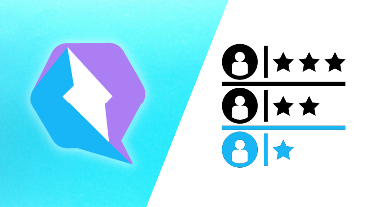
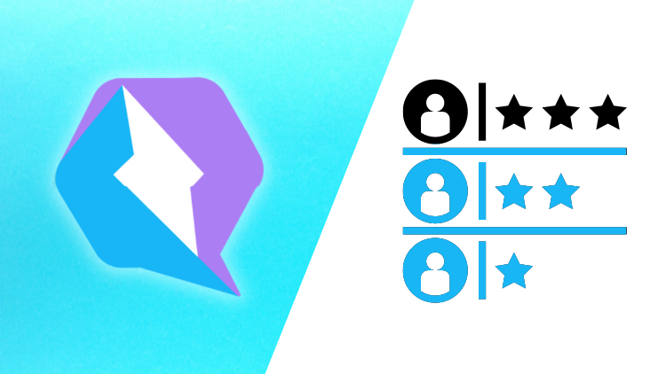

# Curso de Qwik para principiantes en español

Aquí encontrarás toda la información del curso de Qwik para principiantes en español.

## Cómo acceder al curso

El curso se encuentra en UDEMY y puedes acceder a él a través del siguiente [enlace](https://www.udemy.com/user/manuel-sanchez-324/).

El curso lo estoy haciendo con la versión de Node 16.15.1, así que de esa versión en adelante todo debería ir bien.

## Instrucciones para tomar el curso

En cada uno de los proyectos verás un README con explicaciones de su funcionamiento, pero por lo general una vez terminados los conceptos básicos, tendremos una branch `start` con todo el contenido inicial, una branch `main` o `master` con el resultado final, y branches entre medio.

El proceso sería más o menos el siguiente.

Clonar el repo:

    git clone https://github.com/manuelsanchezweb/qwik-curso-principiantes.git
    cd qwik-curso-principiantes

Cambiamos a la branch start.

    git checkout start

Instalamos las dependencias:

    npm install

## Otros cursos y contacto

Si te ha gustado este curso y te has quedado con ganas de más, te invito a que le eches un vistazo a [mi curso de Qwik nivel intermedio-avanzado](https://www.udemy.com/user/manuel-sanchez-324/), en el que practicaremos todo lo aprendido haciendo varias aplicaciones con diseños profesionales.

Además, también puedes subscribirte a mi canal de [YouTube](https://www.youtube.com/channel/UCX3IE_OjG20p_AwbX06YAEg), donde publico de forma periódica contenido interesante.

Si quieres contactar conmigo, puedes hacerlo a través de [manusanchezweb@gmail.com](mailto:manusanchezweb@gmail.com).
